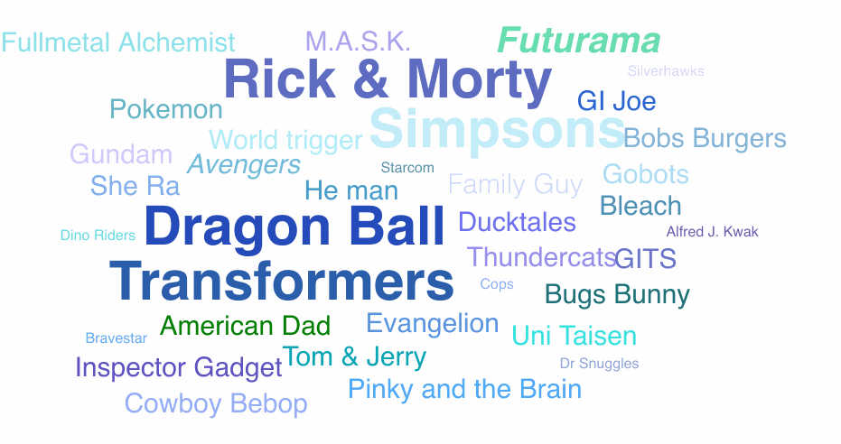

# THIS REPOSITORY IS NO LONGER MAINTAINED

Looking for an alternative? Please have a look at [react-tagcloud](https://github.com/madox2/react-tagcloud).

If you are interested in maintaining this repository (and taking ownership of it), please reach out to me [here](mailto:hrutjes@gmail.com).

# react-tag-cloud ☁️
Create beautiful tag/word clouds using React. Uses the wonderful [d3-cloud](https://github.com/jasondavies/d3-cloud) under the hood.




[View live demo here](https://react-tag-cloud.stackblitz.io/) [(edit code)](https://stackblitz.com/edit/react-tag-cloud?file=App.js)


## Installation

	npm install react-tag-cloud
	or
	yarn add react-tag-cloud

## Usage

```js
import TagCloud from 'react-tag-cloud';
import randomColor from 'randomcolor';

class MyCloud extends Component {
  render() {
    return (
      <TagCloud 
        style={{
          fontFamily: 'sans-serif',
          fontSize: 30,
          fontWeight: 'bold',
          fontStyle: 'italic',
          color: () => randomColor(),
          padding: 5,
          width: '100%',
          height: '100%'
        }}>
        <div style={{fontSize: 50}}>react</div>
        <div style={{color: 'green'}}>tag</div>
        <div rotate={90}>cloud</div>
        ...
      </TagCloud>
    );
  }
}
```

## Documentation

`<TagCloud>` props:

name | description | type | default
-----|-------------|------|---------
style.fontSize | Font size needed for calculating layout | Function/Number | `20`
style.fontFamily | Font family needed for calculating layout | Function/String | `serif`
style.fontWeight | Font weight needed for calculating layout | Function/Number | `normal`
style.fontStyle | Font style needed for calculating layout | Function/String | `normal`
style.padding | Padding between tags (px) | Function/Number | `1`
style.color | Color to be used by tags | Function/String | `(none)`
rotate | Rotation in degrees | Function/Number | `0`
spiral | Spiral | Function/String | `archimedean`
random | Randomizer function | Function | `Math.random`

Any component can be used as a child component. `TagCloud` scans the child components for the following props for its layout calculation:

name | description | type | default
-----|-------------|------|---------
style.fontSize | Font size needed for calculating layout | Function/Number | `20`
style.fontFamily | Font family needed for calculating layout | Function/String | `serif`
style.fontWeight | Font weight needed for calculating layout | Function/Number | `normal`
style.fontStyle | Font style needed for calculating layout | Function/String | `normal`
style.padding | Padding between tags (px) | Function/Number | `1`
style.color | Color to be used by tag | Function/String | `(none)`
rotate | Rotation in degrees | Function/Number | `0`


## Examples

- [(Playground on StackBlitz)](https://stackblitz.com/edit/react-tag-cloud?file=App.js) [(source)](./examples/tagCloud/src/App.js) 
- [ijzerenhein.nl](http://ijzerenhein.nl/)


## Resources

- [https://github.com/jasondavies/d3-cloud](https://github.com/jasondavies/d3-cloud)
- [https://en.wikipedia.org/wiki/Tag_cloud](https://en.wikipedia.org/wiki/Tag_cloud)


## License

[MIT](./LICENSE.txt)


## Cool?

Do you think this cool and useful? Consider buying me a coffee!<br/><a href="https://www.buymeacoffee.com/ijzerenhein" target="_blank"></a>
